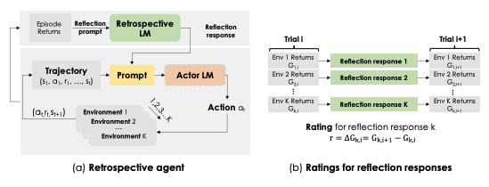

Figure | Name | Summary | Topics
:-: | -- | -- | -- |
 | [Distort, Distract, Decode: Instruction-tuned models can refine their responses from noisy instructions](https://openreview.net/pdf?id=LebzzClHYw) | This paper introduces Instructive Decoding (ID), enhancing instruction-tuned language models by adjusting logits through contrastive manipulation with a noisy instruction. The noisy instruction prompts divergent yet plausible responses, addressing issues of zero-shot generalization. Experimentally, ID shows substantial performance gains across different instruction-tuned models and tasks, with the use of 'opposite' as the noisy instruction consistently producing the most significant improvements in performance. | Fine Tuning |
 | [Retroformer: Retrospective Large Language Agents with Policy Gradient Optimization](https://openreview.net/forum?id=KOZu91CzbK) | The Retroformer introduces a framework for enhancing language agents by learning a retrospective model. This model fine-tunes pre-trained LLMs by automatically adjusting prompts through policy gradient optimization based on feedback from multiple environments and tasks. The proposed architecture demonstrates improved performance over time, outperforming baselines that do not effectively leverage environment gradients in experimental evaluations across various tasks. | New Architecture |
 | [Flask: Fine-Grained Language Model Evaluation Based on Alignment Skill Set](https://openreview.net/pdf?id=CYmF38ysDa) | FLASK introduces a fine-grained evaluation protocol for Large Language Models, addressing challenges in alignment with human values. The protocol focuses on skill set-level scoring, providing a nuanced view of model performance beyond coarse-level evaluations. Experimental findings demonstrate the crucial role of fine-grained evaluation in enhancing reliability and revealing correlations between model-based and human-based assessments. | Evaluation & Benchmarking |
 | [Making Pre-trained Language Models Great on Tabular Prediction](https://openreview.net/pdf?id=anzIzGZuLi) | Despite the strides in transferability for deep neural networks in image and language tasks, leveraging them for tabular data prediction remains underexplored. This paper introduces TP-BERTa, a pre-trained language model specifically designed for tabular data prediction. Unique tokenization and intra-feature attention mechanisms address the challenges of discrete text representations and numerical values in tables. Extensive experiments showcase TP-BERTa's superior performance among tabular DNNs, rivaling Gradient Boosted Decision Tree models in typical tabular data scenarios, with plans for public availability of the pre-trained model. | Task Specific LLMs
 | [Evaluating the Zero-shot Robustness of Instruction-tuned Language Models](https://openreview.net/pdf?id=g9diuvxN6D) | Exploring the zero-shot robustness of instruction-tuned Large Language Models, this paper addresses the sensitivity of models to instruction phrasings and proposes methods to enhance robustness. Through manual collection and evaluation of 319 instructions for diverse tasks, the study reveals degradation in performance with novel instruction phrasings. The paper introduces a simple yet effective method, utilizing "soft prompt" embedding parameters, to enhance model robustness by optimizing the similarity between representations of semantically equivalent instructions. Experimental results consistently demonstrate improved robustness in instruction-tuned models with this approach. | Evaluation & Benchmarking - Prompting |
 | [DP-OPT: Make Large Language Model Your Differentially-Private Prompt Engineer](https://openreview.net/pdf?id=Ifz3IgsEPX) | DP-OPT presents a novel approach for addressing privacy concerns in adapting Large Language Models to sensitive data. The method involves tuning discrete prompts locally and applying them to cloud models, demonstrating competitive performance while preserving privacy. The paper introduces a differentially-private ensemble for in-context learning with private demonstrations, ensuring privacy in prompt generation. DP-OPT provides a practical solution to the challenges of LLM adaptation on sensitive data without compromising data privacy. | Privacy - Prompting |
 | [Large Language Models Are Not Robust Multiple Choice Selectors](https://openreview.net/pdf?id=shr9PXz7T0) | This paper delves into the bias and lack of robustness exhibited by Large Language Models (LLMs) in the context of multiple choice questions (MCQs). Identifying a vulnerability related to option position changes, termed "selection bias," the paper empirically analyzes 20 LLMs across three benchmarks. The investigation reveals that this bias originates from token bias, where specific option ID tokens are favored. To address this, the proposed debiasing method, PriDe, efficiently separates the model's prior bias from overall predictions, demonstrating superior effectiveness and interpretability compared to strong baselines. PriDe's label-free approach shows promise for practical use in diverse domains. | Prompting |
 | [Do Large Language Models Know about Facts?](https://openreview.net/pdf?id=9OevMUdods) | Examining the factual knowledge embedded in Large Language Models, this paper introduces the Pinocchio benchmark to comprehensively evaluate their understanding of diverse facts. Unlike explicit Knowledge Bases, LLMs implicitly store knowledge, but their content may exhibit inaccuracies or deviations. The study, conducted with 20K diverse factual questions, explores LLMs' abilities in composing, updating, reasoning over facts, identifying subtle differences, and handling adversarial examples. Extensive experiments reveal that existing LLMs still lack factual knowledge and may suffer from spurious correlations, highlighting a critical bottleneck for trustworthy artificial intelligence. The Pinocchio dataset and codes will be made publicly available. | Evaluation & Benchmarking |
 | [In-Context Pre-training: Language Modeling Beyond Document Boundaries](https://openreview.net/pdf?id=LXVswInHOo) | This paper introduces In-Context Pretraining, a novel approach to language model training that goes beyond the conventional token prediction from document prefixes. Instead of relying on concatenated random sets of shorter documents, In-Context Pretraining explicitly encourages models to read and reason across document boundaries by training on sequences of related documents. The challenging document sorting problem is addressed through approximate algorithms for efficient nearest neighbor search and coherent batch construction. Experimental results demonstrate the scalability and simplicity of In-Context Pretraining, leading to significant performance enhancements in tasks requiring complex contextual reasoning, such as in-context learning, reading comprehension, faithfulness to previous contexts, long-context reasoning, and retrieval augmentation. | LLM Training |
 | [ToolLLM: Facilitating Large Language Models to Master 16,000+ Real-World APIs](https://openreview.net/pdf?id=dHng2O0Jjr) | This paper addresses the tool-use limitations of open-source Large Language Models, such as LLaMA, by introducing ToolLLM—a comprehensive tool-use framework. ToolBench, an instruction-tuning dataset, is constructed using ChatGPT, involving API collection, instruction generation, and solution path annotation. A novel depth-first search-based decision tree algorithm enhances LLMs' reasoning capabilities. ToolEval, an automatic evaluator, assesses tool-use capabilities. LLaMA is fine-tuned to create ToolLLaMA, demonstrating remarkable execution of complex instructions, generalization to unseen APIs, and strong zero-shot performance in an out-of-distribution tool-use dataset (APIBench). | Task Specific LLMs |
 | [Beyond Memorization: Violating Privacy via Inference with Large Language Models](https://openreview.net/forum?id=kmn0BhQk7p) | This paper extends current privacy research on Large Language Models beyond memorization concerns to address the potential violation of individuals' privacy through inference capabilities. Through a comprehensive study using real Reddit profiles, the authors demonstrate that current LLMs can infer a range of personal attributes with high accuracy at a fraction of the cost and time compared to humans. The research explores the emerging threat of privacy-invasive chatbots extracting personal information through seemingly innocuous questions. Current mitigations like text anonymization and model alignment are found to be ineffective, emphasizing the need for a broader discussion and improved privacy protection measures against LLM inference beyond memorization concerns. | LLM Attacks |
 | [Text2Reward: Dense Reward Generation with Language Models for Reinforcement Learning](https://text-to-reward-review.github.io/) | Addressing the challenge of designing reward functions in reinforcement learning, this paper introduces Text2Reward, a data-free framework leveraging large language models for automated and interpretable dense reward function generation. By translating natural language goals into executable programs grounded in environment representation, Text2Reward produces free-form dense reward codes for a variety of tasks. Evaluation on robotic manipulation benchmarks and locomotion environments demonstrates comparable or improved success rates and convergence speeds compared to expert-written reward codes. The method's policies, refined with human feedback, exhibit versatility and real-world deployment potential. | New Architecture |
 | [Adaptive Chameleon or Stubborn Sloth: Revealing the Behavior of Large Language Models in Knowledge Conflicts](https://openreview.net/pdf?id=auKAUJZMO6) | This paper investigates how Large Language Models respond to knowledge conflicts, exploring whether they act as Adaptive Chameleons, open to external evidence, or Stubborn Sloths, holding onto parametric memory. Utilizing tool augmentation, the study provides external information to LLMs, presenting a controlled investigation into their behavior during conflicts. The findings indicate that LLMs can be highly receptive to external evidence conflicting with their parametric memory, but they also exhibit confirmation bias when presented with consistent information. The results offer important insights for the development and deployment of tool- and retrieval-augmented LLMs, with resources to be released for future research. | Evaluation & Benchmarking - RAG |
 | [Can Sensitive Information Be Deleted from LLMs? Objectives for Defending Against Extraction Attacks](https://openreview.net/pdf?id=7erlRDoaV8) | Addressing safety and privacy concerns in pretrained language models, this paper introduces an attack-and-defense framework to study the challenging task of directly deleting sensitive information from model weights. Focusing on direct edits to ensure non-extractability and protection against whitebox attacks, the study explores scenarios where the answer to sensitive questions is among a set of generated candidates. Despite state-of-the-art model editing methods, the experimental findings reveal challenges in truly deleting information, with attacks successfully recovering "deleted" information 38% of the time. The paper proposes new defense methods, highlighting the difficulty in achieving universally effective defenses against extraction attacks. Results emphasize the complexity of addressing privacy concerns in language models. | LLM Attacks |
 | [MAMMOTH: Building Math Generalist Models Through Hybrid Instruction Tuning](https://openreview.net/forum?id=yLClGs770I) | This paper introduces MAmmoTH, a series of open-source large language models specifically designed for general math problem-solving. Trained on MathInstruct, a meticulously curated instruction tuning dataset, MAmmoTH leverages a unique hybrid of chain-of-thought (CoT) and program-of-thought (PoT) rationales. The dataset encompasses 13 math datasets, including six with newly curated rationales, ensuring extensive coverage of diverse math fields. MAmmoTH outperforms existing open-source models on nine mathematical reasoning datasets, demonstrating significant accuracy gains (16%-32%). Notably, MAmmoTH-7B surpasses the best open-source 7B model on MATH by 23%, while MAmmoTH-34B even outperforms GPT4’s CoT result. The study emphasizes the importance of diverse problem coverage and hybrid rationales in developing superior math generalist models. | Task Specific LLMs |
 | [Understanding and Mitigating the Label Noise in Pre-training on Downstream Tasks](https://openreview.net/pdf?id=TjhUtloBZU) | This paper investigates label noise in pre-training datasets and its impact on downstream tasks in deep learning. Through extensive experiments on synthetic noisy ImageNet-1K and YFCC15M datasets, the study reveals that while slight noise in pre-training benefits in-domain (ID) transfer performance, it consistently deteriorates out-of-domain (OOD) performance. The research empirically demonstrates that noise in pre-training shapes the feature space differently. To mitigate the adverse effects of noise, the paper proposes a lightweight black-box tuning method (NMTune) to affine the feature space, improving generalization on both ID and OOD tasks. Practical experiments on popular vision and language models pre-trained on noisy data validate the effectiveness of the approach, introducing the concept of Noisy Model Learning. | Fine Tuning |
 | [Safe RLHF: Safe Reinforcement Learning from Human Feedback](https://openreview.net/pdf?id=TyFrPOKYXw) | This paper introduces Safe Reinforcement Learning from Human Feedback (Safe RLHF), a novel algorithm designed to address the inherent tension between helpfulness and harmlessness during the training of large language models. By decoupling human preferences regarding these objectives, Safe RLHF avoids confusion and allows the training of separate reward and cost models. The safety concern of LLMs is formalized as an optimization task, maximizing the reward while satisfying specified cost constraints. Leveraging the Lagrangian method, Safe RLHF dynamically adjusts the balance between the two objectives during fine-tuning. Experimental results demonstrate the algorithm's superior ability to mitigate harmful responses while enhancing model performance, as seen in the fine-tuning of Alpaca-7B. A warning is issued regarding potentially offensive or harmful example data within the paper. | LLM Training - New Architecture |
 | [Tool-Augmented Reward Modeling](https://openreview.net/pdf?id=d94x0gWTUX) | This paper introduces Themis, a tool-augmented preference modeling approach designed to enhance reward modeling (RM) within large language models, especially in the context of reinforcement learning from human feedback (RLHF). Traditional RMs face challenges in tasks like arithmetic computation, code execution, and factual lookup. Themis addresses these limitations by integrating external tools, such as calculators and search engines, into RMs. This approach not only fosters synergy between tool utilization and reward grading but also improves interpretive capacity and scoring reliability. Experimental results demonstrate a noteworthy overall improvement of 17.7% across eight tasks in preference ranking, outperforming Gopher 280B by 7.3% on the TruthfulQA task in zero-shot evaluation. Human evaluations show RLHF trained with Themis achieving an average win rate of 32% compared to baselines across four distinct tasks. The paper also provides a comprehensive collection of tool-related RM datasets, totaling 15,000 instances, to facilitate further research advancements in the field. | LLM Training |
 | [Quick-Tune: Quickly Learning Which Pretrained Model to Finetune and How](https://openreview.net/pdf?id=tqh1zdXIra) | This paper presents Quick-Tune, a methodology addressing the challenge of selecting the optimal pretrained model and its hyperparameters for finetuning on a new dataset. Faced with a growing number of pretrained models, machine learning practitioners often grapple with these decisions. Quick-Tune leverages knowledge about the performance of numerous pretrained models and their hyperparameter configurations across various datasets. The authors evaluate over 20,000 hyperparameter configurations for finetuning 24 pretrained image classification models on 87 datasets, creating a large-scale meta-dataset. Through meta-learning, they develop a gray-box performance predictor based on learning curves, enabling fast hyperparameter optimization on new datasets. Empirical results demonstrate Quick-Tune's effectiveness in quickly selecting an accurate pretrained model for a new dataset along with its optimal hyperparameters. | Fine Tuning |
 | [Model Tells You What to Discard: Adaptive KV Cache Compression for LLMs](https://openreview.net/pdf?id=uNrFpDPMyo) | This study introduces Adaptive KV Cache Compression, a plug-and-play method designed to reduce the memory footprint of generative inference for Large Language Models. Unlike conventional KV caches, which retain key and value vectors for all context tokens, this approach employs targeted profiling to discern the intrinsic structure of attention modules. Based on this recognized structure, the authors construct the KV cache adaptively, evicting long-range contexts on attention heads emphasizing local contexts, discarding non-special tokens on attention heads centered on special tokens, and utilizing the standard KV cache for attention heads that broadly attend to all tokens. Additionally, with lightweight attention profiling guiding the construction of the adaptive KV cache, the proposed method, FastGen, demonstrates a significant reduction in GPU memory consumption across various tasks, with negligible generation quality loss. The code and compatible CUDA kernel will be released for reproducibility. | New Architecture |
 | [Knowledge Card: Filling LLMs’ Knowledge Gaps with Plug-In Specialized Language Models](https://openreview.net/pdf?id=WbWtOYIzIK) | This paper introduces KNOWLEDGE CARD, a modular framework designed to address the knowledge gaps in large language models  by plugging in new factual and relevant knowledge. The authors propose knowledge cards—specialized language models trained on corpora from specific domains and sources. These knowledge cards serve as parametric repositories selected at inference time to generate background knowledge for the base LLM. The paper introduces three content selectors to dynamically choose and retain information in documents generated by knowledge cards, controlling for relevance, brevity, and factuality of outputs. Two integration approaches are proposed to augment the base LLM with relevant and factual knowledge curated from specialized language models. Extensive experiments demonstrate that KNOWLEDGE CARD achieves state-of-the-art performance on six benchmark datasets. The framework enables dynamic synthesis and updates of knowledge from diverse domains with modularity for continuous community-driven knowledge updates. | New Architecture - RAG |
 | [LongLoRA: Efficient Fine-Tuning of Long-Context Large Language Models](https://openreview.net/pdf?id=6PmJoRfdaK) | This paper introduces LongLoRA, an efficient fine-tuning approach for large language models that extends context sizes with limited computational cost. Traditional training of LLMs with long context sizes is computationally expensive, requiring extensive resources. LongLoRA addresses this by employing shifted sparse attention (S2-Attn) during fine-tuning, enabling effective context extension with significant computation savings. The proposed approach is compatible with most existing techniques, such as Flash-Attention2, and demonstrates strong empirical results on various tasks using Llama2 models ranging from 7B/13B to 70B. LongLoRA extends models' context while retaining their original architectures, making it a versatile and efficient solution for large-scale language models. The paper also explores supervised fine-tuning on LongLoRA models with long instruction-following data. Code and models will be made publicly available. | Fine Tuning |
 | [LoftQ: LoRA-Fine-Tuning-Aware Quantization for Large Language Models](https://openreview.net/pdf?id=LzPWWPAdY4) | This paper introduces LoftQ (LoRA-Fine-Tuning-aware Quantization), a novel quantization framework designed for Large Language Models that undergo LoRA fine-tuning. The proposed approach simultaneously quantizes an LLM while finding an appropriate low-rank initialization for LoRA fine-tuning. This initialization helps bridge the performance gap observed in downstream tasks between full fine-tuning and the quantization plus LoRA fine-tuning approach. LoftQ is evaluated on various natural language processing tasks, including natural language understanding, question answering, summarization, and natural language generation. Experimental results demonstrate the effectiveness of LoftQ, particularly in challenging 2-bit and 2/4-bit mixed precision regimes, outperforming existing quantization methods. The authors plan to release their code for further exploration. | Fine Tuning |
 | [Improving Out-of-Domain Generalization with Domain Relations](https://openreview.net/pdf?id=Dc4rXq3HIA) | This paper addresses the challenge of distribution shift in machine learning, focusing specifically on domain shifts that occur when models are applied to new domains different from those they were trained on. The proposed approach, named D3G, stands for Domain Relation-based Domain-specific Generalization. Unlike existing methods that aim for a single domain-invariant model, D3G leverages domain similarities based on domain metadata to learn domain-specific models. During training, D3G learns a set of training-domain-specific functions, and during testing, it reweights them based on domain relations obtained from domain metadata. The paper provides theoretical proof that using domain relations for reweighting achieves stronger out-of-domain generalization compared to conventional averaging approaches. Empirical evaluations on real-world datasets for tasks such as temperature regression, land use classification, and molecule-protein binding affinity prediction demonstrate that D3G consistently outperforms state-of-the-art methods. | Task Specific LLMs |
 | [CABINET: Content Relevance-Based Noise Reduction for Table Question Answering](https://openreview.net/pdf?id=SQrHpTllXa) | This paper addresses the challenge of noise reduction in table question-answering tasks for Large Language Models. LLMs often struggle with irrelevant information in tables, affecting the overall performance of question-answering. The proposed framework, CABINET (Content Relevance-Based Noise Reduction for Table Question-Answering), introduces an Unsupervised Relevance Scorer (URS) that is differentially trained with the Question-Answering LLM (QA LLM). URS assigns weights to table content based on its relevance to the input question, allowing the QA LLM to focus on relevant information. Additionally, CABINET employs a weakly supervised module that generates a parsing statement describing the criteria for relevant rows and columns, further aiding the relevance scorer. Experimental results demonstrate that CABINET outperforms various tabular LLM baselines, including GPT-3-based in-context learning methods. It exhibits robustness to noise, maintains performance across tables of varying sizes, and establishes new state-of-the-art (SoTA) performance on WikiTQ, FeTaQA, and WikiSQL datasets. The code and datasets are released for public access. | Task Specific LLMs |
 | [REALCHAT-1M: A Large-Scale Real-World LLM Conversation Dataset](https://openreview.net/pdf?id=BOfDKxfwt0) | This paper introduces RealChat-1M, a comprehensive dataset comprising one million real-world conversations involving 25 state-of-the-art Large Language Models. The dataset is collected from 210,000 unique IP addresses through interactions on a chat demo website, providing a diverse and extensive collection of conversations. The paper outlines the curation process, offering insights into basic statistics, topic distribution, and emphasizing the dataset's diversity, originality, and scale. RealChat-1M is showcased in four use cases: development of content moderation models comparable to GPT-4, establishment of a safety benchmark, training of instruction-following models akin to Vicuna, and creation of challenging benchmark questions. The authors anticipate that this dataset will serve as a valuable resource for advancing the understanding and capabilities of LLMs. The dataset will be made publicly available for research purposes. | Evaluation & Benchmarking | 
 | [Batched Low-Rank Adaptation of Foundation Models](https://openreview.net/pdf?id=w4abltTZ2f) | This paper presents Batched Low-Rank Adaptation (BLORA), a framework designed to efficiently handle multiple task-specific adapters for fine-tuning foundation models. Low-Rank Adaptation (LoRA) has gained attention for its ability to incorporate trainable low-rank matrices, thereby reducing the number of trainable parameters during fine-tuning. However, its application to real-time serving for a diverse and global user base is limited due to challenges in handling multiple task-specific adapters efficiently. BLORA addresses this limitation by introducing a framework where each input example in a minibatch can be associated with its unique low-rank adaptation weights, allowing for the efficient batching of heterogeneous requests. The empirical results demonstrate that BLORA preserves the performance advantages of LoRA, achieving competitive results on the MultiPL-E code generation benchmark across eight languages and a multilingual speech recognition task involving six languages. | Fine Tuning |
 | [Fine-tuning Aligned Language Models Compromises Safety, Even When Users Do Not Intend To!](https://openreview.net/forum?id=hTEGyKf0dZ) | This paper explores the safety risks associated with fine-tuning aligned Large Language Models for downstream use cases. While existing safety alignment techniques aim to restrict harmful behaviors of LLMs at inference time, this study investigates the potential compromise of safety alignment during fine-tuning, especially when the fine-tuning privileges are extended to end-users. The research demonstrates that the safety alignment of LLMs can be compromised with only a few adversarially designed training examples, highlighting the vulnerability of models like GPT-3.5 Turbo to harmful instructions. Furthermore, the study reveals that even benign and commonly used datasets for fine-tuning can inadvertently degrade the safety alignment of LLMs. The paper emphasizes the need for enhanced safety protocols to address these risks and discusses potential mitigations. The findings raise critical questions about maintaining safety alignment after customized fine-tuning, urging further research in this area. | Fine Tuning - Privacy |
 | [A Real-World WebAgent with Planning, Long Context Understanding, and Program Synthesis](https://openreview.net/pdf?id=9JQtrumvg8) | This paper introduces WebAgent, an LLM-driven agent designed for autonomous web automation on real-world websites. The challenges faced by existing models, including open domainness, limited context length, and a lack of inductive bias on HTML, are addressed in WebAgent. The agent plans ahead by decomposing instructions into sub-instructions, summarizes long HTML documents into task-relevant snippets, and executes actions on websites through Python programs generated from the summarized information. The paper presents the design of WebAgent, incorporating Flan-U-PaLM for grounded code generation and HTML-T5, a novel pre-trained LLM tailored for long HTML documents using local and global attention mechanisms. Empirical results demonstrate that the proposed approach significantly improves success rates on real websites, showcasing over 50% improvement. Additionally, HTML-T5 achieves state-of-the-art performance on web automation benchmarks, outperforming prior methods. | Task Specific LLMs |
 | [Time-LLM: Reprogramming Language Models for Superior Time Series Forecasting](https://arxiv.org/pdf/2310.01728v2.pdf) | This paper introduces Time-LLM, a framework that reprograms large language models for highly effective time series forecasting. By aligning time series data with natural language, Time-LLM leverages the robust pattern recognition abilities of LLMs. The Prompt-as-Prefix (PaP) technique enriches input context, enhancing the LLM's ability to reason with time series data. Comprehensive evaluations demonstrate that Time-LLM outperforms specialized models, excelling in both few-shot and zero-shot learning scenarios. | Task Specific LLMs |